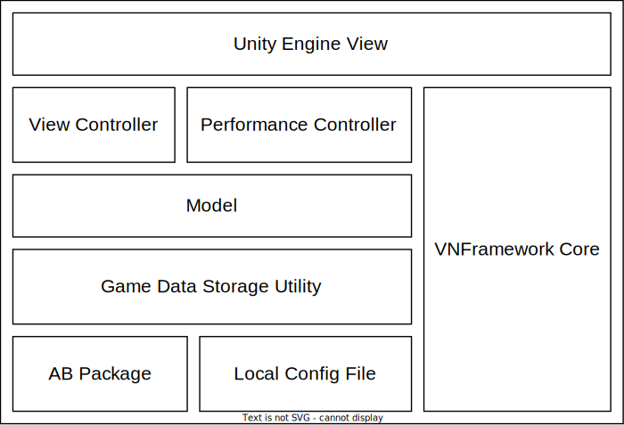

# VNFramework


## Program Architecture



## Todo List

- [x] 基础的VNScript语法解释器
- [x] 实现VNFramework的基础UI
- [x] ChapterView的章节加载
- [x] 已解锁章节的保存与加载，游戏设置的保存与加载
- [x] 引入QFramework，将框架转换为MVC架构
- [x] 视觉小说资源的AB包加载
- [x] 实现全屏文字的文本演出模式
- [x] 窗口多分辨率切换
- [x] 剧情的多分支支持
- [ ] 编写游戏资源管理插件
- [ ] 为 VNMermaid 语法添加可视化支持
- [ ] 为 VSCode 编写 VNScript 语法检查插件
- [ ] `game_info` 增加更多自定义属性
- [ ] Dialogue Box 中，对话中的英文单词在行末自动添加换行符

## Screenshot

由于没有美术，所以当前版本的界面比较丑，请见谅。。。

**Chapter View**


**Game Save View**


**Norm Performance View**


**Full Performance View**


**Backlog View**


**Config View**


**Menu View**


## VN Mermaid

剧情选项是视觉小说的精髓，VNFramework 实现剧情选项的方法是使用 `VNMermaid` 语法，来源是借鉴了 markdown 的 mermaid 流程图语法

`VNMermaid` 有三种语法，分为定义语法，链接语法，以及注释语法。

`VNMermaid` 语法中，在行的开始位置使用「`#`」 字符，则表示当前行是注释行，在进行语法解析时会将这行忽略。

### VNMermaid Example

```
# 这部分是定义
Prologue[Prologue]
Route_1[prologue_route_1_1]
第二次拒绝离开[prologue_route_1_1_1]
决定离开[prologue_route_1_2]
Route_2[prologue_route_2]

# 这部分是链接
Prologue -->|听她们的话，离开家躲起来| 决定离开
Prologue -->|不......这是我的家，我不放心你们| Route_1
Route_1 -->|还是听她们的话吧...| 决定离开
Route_1 -->|不，我要跟着去| Route_2
```

#### Define Syntax

```
# 节点名称[VNScript脚本名称]
mermaidNodeName[VNScriptChapterName]
```

#### Link Syntax

如果一个 `fromNode` 的 `toNode` 的 `optionText` 为空，则该 `fromNode` 只能有这一个 `toNode`。这表示该 `fromNode` 在执行完之后将直接加载 `toNode`，而不会弹出任何选项。

如果一个 `fromNode` 的 `toNode` 的 `optionText` 不为空，则 `fromNode` 会在执行完之后弹出一个选项，选项的文本为 `optionText`，选项的跳转目标为 `toNode`。
```
# case 1
fromNode -->|optionText| toNode

# case 2
fromNode --> toNode
```


## VNScript Syntax

一个好的视觉小说的剧本格式应该达到以下三点要求。

1. 能够让剧作家在阅读剧本时就能想到游戏运行时是什么样子。
2. 剧作家并不是程序员，不能将过多的技术细节暴露给剧作家。
3. 剧本格式应该尽量简单且美观，减少阅读剧本时的视觉负担。

为了达到以上三点要求，剧本格式我采用了标记语言的形式，以下是剧本格式的一段样例。

```
# 播放背景音乐，音乐名称 the_rain_of_night
[ bgm_play: the_rain_of_night ]

# 开始对话
写下这篇序言的时候我在赤道以南的巴厘岛，这是我今年第二次来印度尼西亚。
-> 这边的酒店都会给客人准备一个很宽敞的露台，露台上放一盏烛和一盒火柴，
-> 外面是星垂平野，或者雷电打落在海面上，黑暗那么深邃。

# 播放语音
江南 : (chapter01_001)在寂静的夜里点燃蜡烛放在栏杆上，心就安静下来。
> (chapter01_002)仿佛一种仪式开始，神秘的气息氤氲的降下，可以开始缓缓的讲诉平生。

# 停止播放背景音乐
[ bgm_stop ]
# 设置背景音乐音量，然后播放新的背景音乐
[ bgm_vol: 0.4 ] [ bgm_play: goodbye_black_bird ]
```

### 对话语句

对话语句有两种格式，一种格式是，一行单独的字符串，用于表现主视角角色的陈述或者内心想法。

另一种格式由两个字符串组成（字符串 : 字符串），常用于对话，第一个字符串是说话角色名字，第二个字符串是该角色说的话。

```
# 这是第一种对话格式
写下这篇序言的时候我在赤道以南的巴厘岛，这是我今年第二次来印度尼西亚。

#这是第二种对话格式
江南: 在寂静的夜里点燃蜡烛放在栏杆上，心就安静下来。
```

### 继续输出语句

有的时候我们会希望在文字输出的中间添加一个暂停，等到用户输入一个回车或者是空格之后再继续打印接下来的字符，这样的使用场景下，我们可以使用继续输出的语法。

继续输出语法有两种格式，一种格式是使用符号 ->，它会在用户输入回车之后将新文本输出到旧文本的后面。

另一种是使用符号 > ，它会在用户输出回车之后，另起一个新行输出新文本。

```
# 第一种继续输出方法，将新文本输出到旧文本的后面
写下这篇序言的时候我在赤道以南的巴厘岛，这是我今年第二次来印度尼西亚。
-> 这边的酒店都会给客人准备一个很宽敞的露台，露台上放一盏烛和一盒火柴，
-> 外面是星垂平野，或者雷电打落在海面上，黑暗那么深邃。

# 第二种继续输出方法，另起新行输出新文本
在寂静的夜里点燃蜡烛放在栏杆上，心就安静下来。
> 仿佛一种仪式开始，神秘的气息氤氲的降下，可以开始缓缓的讲诉平生。
```

### 全屏文字演出模式

如果不希望使用底部文本框，而希望使用全屏文本框来输出剧本，可使用全屏文本语法。

全屏文本语法与其他语法的区别在于在句子开头添加 `|` 符号，用于提示语法编辑器此处为全屏文本区域

```
| 写下这篇序言的时候我在赤道以南的巴厘岛，这是我今年第二次来印度尼西亚。
| -> 这边的酒店都会给客人准备一个很宽敞的露台，露台上放一盏烛和一盒火柴，
| -> 外面是星垂平野，或者雷电打落在海面上，黑暗那么深邃。

| 江南 : (chapter01_001)在寂静的夜里点燃蜡烛放在栏杆上，心就安静下来。
| > (chapter01_002)仿佛一种仪式开始，神秘的气息氤氲的降下，可以开始缓缓的讲诉平生。
```

### 角色语音语句

如果希望在输出某段对话时同步播放角色语音，可以在对话的开头使用角色语音语法，即使用圆括号将需要调用的语音名称括起来。

```
江南 : (chapter01_001)在寂静的夜里点燃蜡烛放在栏杆上，心就安静下来。

(chapter01_002)仿佛一种仪式开始，神秘的气息氤氲的降下，可以开始缓缓的讲诉平生。
```

### 方法语句

在一部视觉小说中，不可避免的需要在剧情的进行途中加载背景图片、加载图片立绘、播放音乐。因此剧本格式应该提供一个简便的语法去实现这些功能。

剧本方法的语法是用中括号将函数的名称包裹起来，如果函数需要使用参数，则在方法名称后添加冒号，在冒号后填写函数的参数，参数与参数之间用逗号隔开。

```
# 不使用参数的函数
[ bgm_stop ]

# 使用一个参数的函数
[ bgm_play : audio_name]

# 使用两个参数的函数
[ role_pic: pos, pic_name]
```

在剧本中可使用的命令可以参照ILScript中列出的命令

常用的命令有以下几种

```
# 显示角色立绘语法
# pos : left / mid / right
# mode : fading / immediate
[ role_pic: pos, pic_name, mode ]

# 播放背景音乐语法
[ bgm: audio_name ]

# 设置音量语法
# 音量大小在 0 ~ 1 之间
# bgm_vol: 背景音乐音量
# bgs_vol: 背景音效音量
# role_vol: 角色语音音量
# 在ILCommand中，role_vol被简写为chs_vol，意为character sound volume
[ bgm_vol: vol_value ]
[ bgs_vol: vol_value ]
[ role_vol: vol_value ]
```

关于 `VNScript` 的更多方法，可参考 [VNScript Document](./docs/VNScriptDocument.md)

## Game Config File

### VNFramework Resources

`Resources` 文件夹是游戏运行时加载资源的文件夹，所有的图片，音频，视频，剧本，配置文件等都以 `AB` 的形式存放在其中。

每次添加了新的文件，都需要对资源进行重新的打包操作才能在游戏中生效。

为了让资源管理更方便，因此图像，音频，视频等文件请分别放入对应的文件夹，程序会根据文件夹自动为文件打上标签，并在游戏中以标签对文件进行加载。


> Note: 添加新的文件后，可使用编辑器工具栏的 `VNFrameworkTools/Set AB Label` 功能对文件进行快速的添加标签操作。

### file: game_info

`game_info` 用于简化定制视觉小说UI的步骤，存放路径为 `Assets/VNFramework/Resources/ProjectData/game_info.txt`

```
[ Title View ]
logo: example_logo
bgm: 月姬
bgp: white

[ Game Save View ]
bgm: 月姬
bgp: white
gallery_item_pic: save_file_gallery_item
gallery_list_pic: white

[ Backlog View ]
bgp: backlog_view_white
text_color: #000000
back_button_text_color: #000000

[ Performance View ]
norm_name_box_pic: dialogue_box
norm_dialogue_box_pic: dialogue_box
full_dialogue_box_pic: dialogue_box
menu_view_button_pic: menu_view_button
backlog_view_button_pic: backlog_view_button
config_view_button_pic: config_view_button
```

### file: save_file

`save_file.txt` 是视觉小说的存档文件，用于记录游戏的存档信息，存放路径为 `Config/save_file.txt`

此文件会在游戏启动时自动生成，不需要额外的操作。

```
<|
    [ save_index: 0 ]
    [ save_date: 2023-08-10 12:27:27 ]
    [ mermaid_node: Prologue ]
    [ script_index: 0 ]
    [ resume_pic:  ]
    [ resume_text: 「志贵君，你还记得发生了什么事吗？」 ]
|>
<|
    [ save_index: 1 ]
    [ save_date: 2023-08-10 14:17:07 ]
    [ mermaid_node: Prologue ]
    [ script_index: 40 ]
    [ resume_pic:  ]
    [ resume_text: 「————看来脑部果然有异常。 ]
|>
```

### file: chapter_info

该文件为选择性填写，如果需要将某些特定章节在Chapter View 中展示，那么可以使用 `chapter_info` 文件。

当文件执行到相应的 Mermaid 节点后，程序会将该节点的信息记录到 `unlocked chapter` 中，并保存在本地。

`chapter_info.txt` 用于声明视觉小说中会用到的剧本的信息，`Chapter View` 会根据该文件填写的内容来选择展示的信息。

- show_name：在 `Chapter View` 上显示的名称

- mermaid_name: 当前章节对应的 `MermaidNode` 的名称


```
<|
    [ show_name: Prologue ]
    [ mermaid_name: Prologue ]
    [ resume: 那个少女的眼眸是冰山一般的苍蓝 ]
    [ resume_pic: 神社外_夜 ]
|>

<|
    [ show_name: 线路一 ]
    [ mermaid_name: Route_1 ]
    [ resume: “真的永远都不会把我忘掉？”她耳语似的低声询问。<br>“永远不会忘，对你我怎么能忘呢！” ]
    [ resume_pic: suka ]
|>

<|
    [ show_name: 线路二 ]
    [ mermaid_name: Route_2]
    [ resume: 那天晚上，神社的火光照亮了整个夜空<br>没人知道为什么火能如此凶猛，简直...就如同是从地狱烧上来的一样 ]
    [ resume_pic: city_00 ]
|>
```

### file: unlocked_chapter

`unlocked_chapter`用于记录玩家当前已完成的章节，存放路径为 `Config/unlocked_chapter.txt`

```
[ mermaid_name:  chapter_01 ]
[ mermaid_name:  chapter_02 ]
[ mermaid_name:  chapter_03 ]
```

## License

本项目基于MIT许可证


